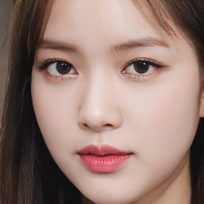

## IDOL FACE PROJECT

**Web Application on Generative model using React and Flask** 
Chan (Samuel) Yoo 

Description: *Trained StyleGAN2 model from NVidia using idol face dataset found from kaggle. This process took approximately 30 hours, using a single GPU and resolution of 256 x 256. The finalised model was implemented to the react application, creating new images when requested. The application uses react frontend and flask backend, has features such as altering truncation psi, noise input, keeping seed, and keeping favourite images. The model could be improved by using a better/more GPU, which would lead to higher resolution images. Also having a less biased dataset (curret dataset had bias from having more images from certain celebrities), and having greater variety of celebrities would improve the output.*